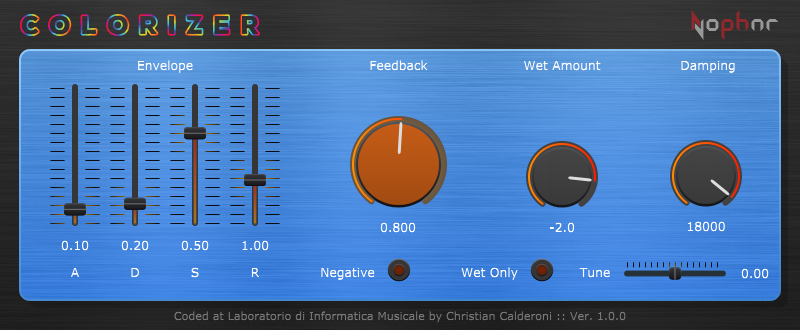
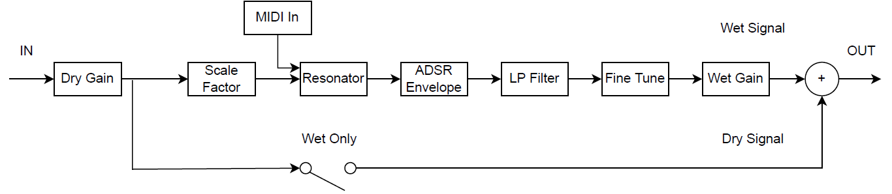

# Colorizer-VST

**Last update: April 2022**

A MIDI-controlled polyphonic resonator VST plugin.

  

Colorizer is a MIDI-controlled polyphonic resonator. The algorithm adjusts the delay time of up to eight independent fractional delay lines with feedback to generate pitch-specific resonances in the input signal, based on the MIDI notes played by the user.

You can find the Windows compatible '.vst3' file here: [Colorizer Windows](Builds/Windows/x64).

Alternatively, you can download the compiled VST3 and Audio Unit (AU) plugin versions from the following link: [Colorizer plugin](https://audioplugins.lim.di.unimi.it/index.php?p=2) (search for "Colorizer").

## Parameters

- ADSR: controls the amplitude envelope applied to the wet signal.
- Feedback: adjusts the intensity and duration of the resonances by setting the feedback level of the delay lines.
- Negative: inverts the sign of the feedback multiplication factor, emphasizing odd harmonics over even ones.
- Wet Amount: sets the level of the wet signal.
- Damping: sets the cutoff frequency of the low-pass filter in the feedback path, affecting how quickly high frequencies decay.
- Tune: allows fine-tuning of the overall pitch of the resonated signal.

## Block Diagram

  

## Notes

The JUCE project was created using Juce version 6.0.8, and was compiled using c++14 and Visual Studio 2019.

This product was developed by Christian Calderoni at the Laboratorio di Informatica Musicale of the Università degli Studi di Milano as part of a BSc thesis project. It has no commercial or marketing goals. Therefore, the developer shall not be held liable for any potential issues, including data loss, damages of any kind, or other inconveniences resulting from defects in the product.
